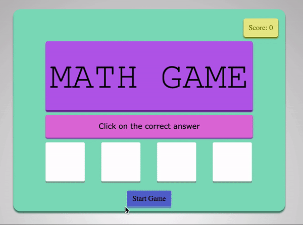
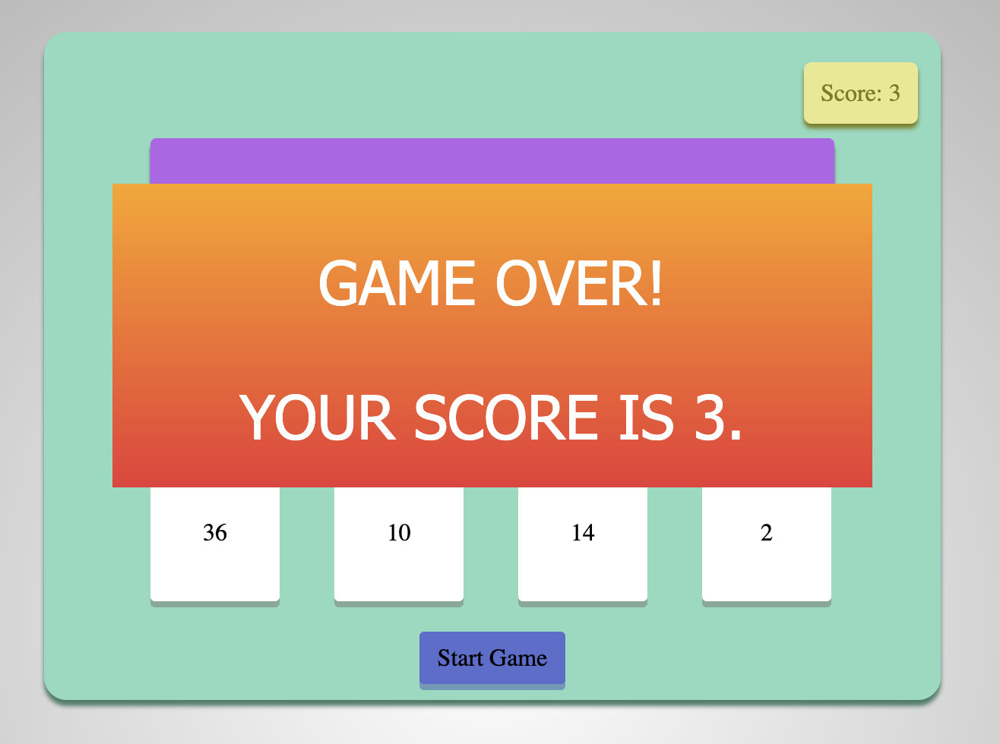

# Maths-Game-JS

## Deployed on GH-Pages
https://developer-soni.github.io/Maths-Game-JS/ 

## Description
I have created a Simple Maths Game using Javascript and basic HTML and CSS. \
The game starts with a timer for 60 seconds and the score increases as you keep selecting the right answers. \
Integrated JavaScript to manipulate DOM and display answers. 

## How to Play Game
Run index.html to play.

## Gameplay

